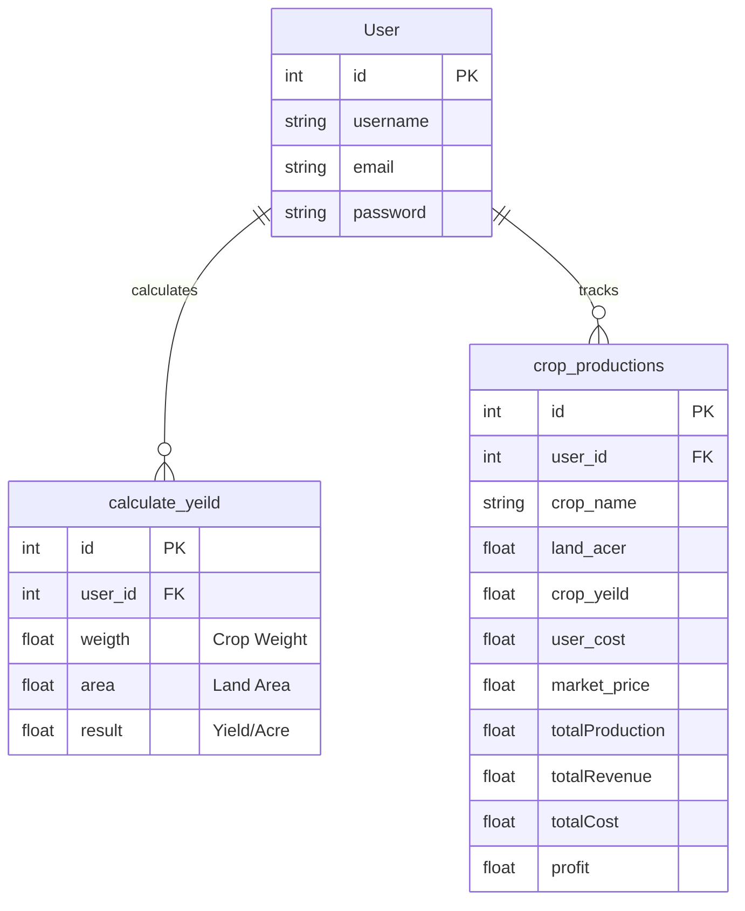
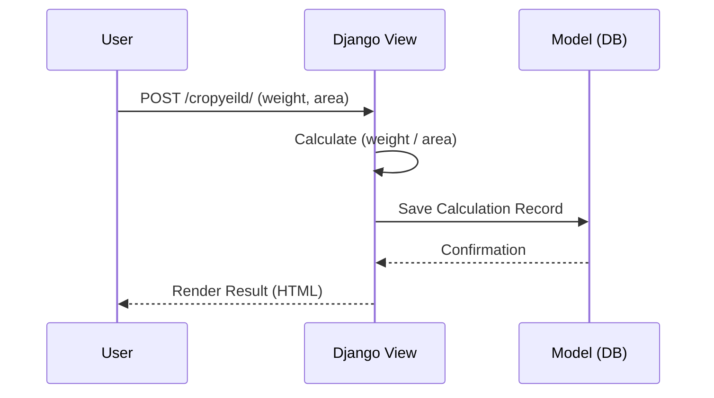
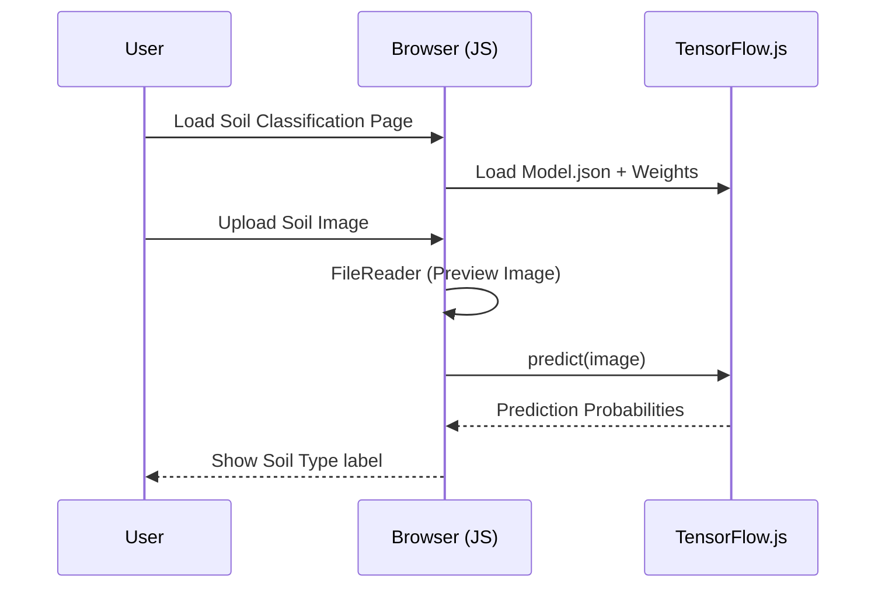

# Smart Agriculture Management System (SAMS) - Architecture

## 1. System Overview
SAMS is a hybrid web application blending server-side processing (Django) for business logic/data persistence with client-side AI (TensorFlow.js) for real-time analysis. This architecture ensures low latency for heavy ML tasks while maintaining a secure, centralized record of user data.

## 2. Technology Stack

| Layer | Technology | Purpose |
| :--- | :--- | :--- |
| **Frontend** | HTML5, CSS3, JavaScript | UI Structure and Styling |
| **Client-Side AI** | **TensorFlow.js** | In-browser image classification (Soil Type) |
| **Backend** | **Python (Django)** | Request handling, auth, business logic |
| **Database** | **SQLite** | relational data storage (User, Yield, Production) |
| **Auth** | Django Auth | Session-based user authentication |

## 3. High-Level Architecture

```mermaid
graph TD
    User[User / Farmer] -->|HTTPS Request| WebServer[Django Web Server]
    User -->|Upload Image| BrowserML[TensorFlow.js (Browser)]
    
    subgraph "Server Side (Django)"
        WebServer -->|Auth Check| AuthSystem
        WebServer -->|Calculate| BizLogic[Business Logic Views]
        BizLogic -->|Read/Write| DB[(SQLite Database)]
        BizLogic -->|Render| Templates[Django Templates]
    end
    
    subgraph "Client Side"
        BrowserML -->|Inference| ModelFiles[Static TF Model Files]
        BrowserML -->|Result| DOM[Update UI]
    end
```

## 4. Database Schema (Entity-Relationship)

The system uses a relational schema centered around the `User` to personalize farming data.



## 5. Key User Flows

### A. Yield Calculation (Server-Side)
Standard Request-Response cycle for reliable data tracking.



### B. Soil Classification (Client-Side)
Zero-latency inference using pre-loaded model assets.



## 6. Project Directory Structure

```plaintext
SmartAgriculture/
├── manage.py                   # Django entry point
├── db.sqlite3                  # Local Database
├── farming/                    # Main Application
│   ├── models.py               # Data definitions (Yield, Production)
│   ├── views.py                # Core Logic (Calculators, Renderers)
│   ├── urls.py                 # Route definitions
│   ├── static/                 # Static Assets
│   │   ├── model.json          # TF.js Model Architecture
│   │   └── metadata.json       # Model Labels
│   └── templates/              # HTML Files
│       ├── soil-classification.html # AI Integration point
│       ├── cropyeild.html      # Calculator Form
│       └── ...
└── Smart Agriculture Mangemnet/ # Project Config (Settings, WSGI)
```
